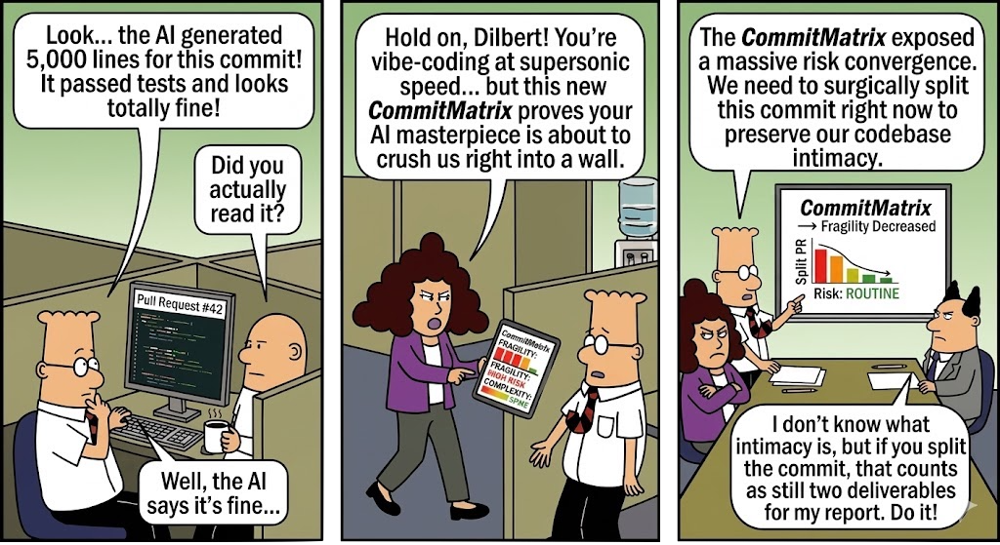
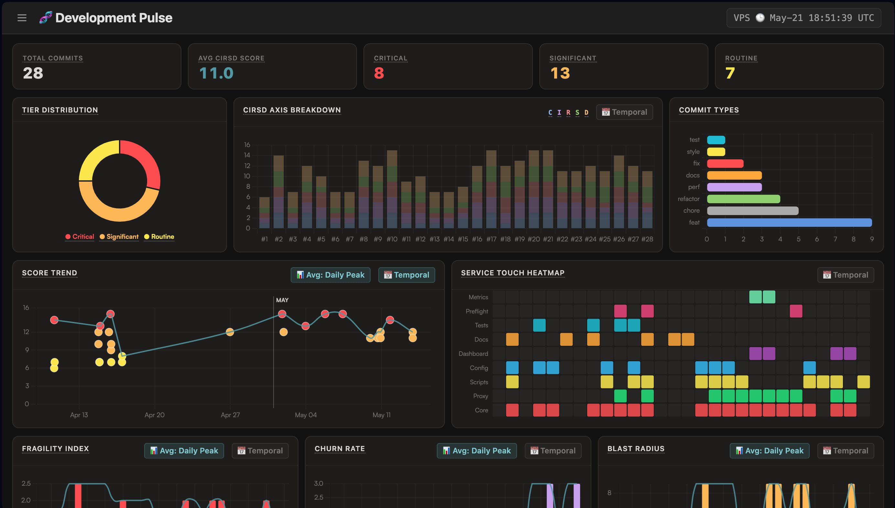

# CommitMatrix 🧬

**Architectural telemetry and multi-level visibility layer for AI-accelerated development.**

<p align="center">
  
</p>

GenAI has made it trivial to generate huge volumes of code. Velocity is up, but visibility is down. We have more commits, more diffs, and less intuition about what that code is doing to our systems.

CommitMatrix turns raw Git history into an interactive risk console so you can ship faster without quietly scaling technical debt.

- **For developers:** regain codebase intimacy with a commit-level blast-radius check before review.
- **For teams:** measure value, not volume, by seeing whether delivery is clean or quietly increasing fragility.
- **For leadership:** govern AI acceleration with an objective view of architectural risk across repositories.

CommitMatrix is a lightweight telemetry engine that uses LLMs to semantically analyze Git diffs and score commits against architectural rubrics. It transforms commit history into a multi-axis view of impact, complexity, scope, and risk through interactive ledgers, heatmaps, and charts.


---

## What CommitMatrix does

At its core, CommitMatrix is a three-layer telemetry pipeline over your Git history:

- **Data ingestion**  
  A lightweight agent reads your local Git repository, extracting diffs and metadata for each commit.

- **LLM‑powered evaluation**  
  A Python backend (`backend/main.py`, `backend/parser.py`) sends diffs through an LLM via LiteLLM, constraining the model to output deterministic JSON scored against ready-made rubrics.

- **Interactive console**  
  A vanilla ES6/HTML frontend (`templates/matrix.html`, `static/js/*`) reads the ledgers in `/data` and renders heatmaps, charts, and tables that adapt dynamically to whatever rubric you use.

Scoring and visualization are driven by specialized rubrics that measure what is most critical across different project types and engineering concerns.

<p align="center">
  
</p>

---

## Why teams use it

CommitMatrix is built for AI-accelerated software delivery: more generated code, larger diffs, faster iteration, and less natural architectural intuition.

- **Before a PR**  
  Check whether an AI-assisted refactor increased complexity without delivering meaningful impact.

- **During review**  
  Spot wide blast-radius changes that look harmless in the text diff but clearly spike systemic risk.

- **During stabilization**  
  See where fragility is clustering and whether risk is actually flattening over time.

- **Across multiple repos**  
  Monitor where architectural complexity and systemic risk are accumulating so you can intervene early.


> “The diff looks fine, but the CommitMatrix shows a blast-radius spike. Let’s split this change before it lands.”

---

## Getting started (1–2 minutes)

### Prerequisites

- Docker and Docker Compose
- Git
- An API key for at least one LiteLLM-supported provider (e.g. OpenAI, Anthropic, Gemini)

### 1. Clone and configure

```bash
git clone https://github.com/oliverpecha/commit-matrix.git
cd commit-matrix

cp .env.example .env
# Edit .env to set your LLM API key and to generate a dashboard access token for ?token=YOUR_TOKEN
```


### 2. Install the CLI

```bash
bash install.sh
```

This binds a global `commit-matrix` command and prepares the Docker environment via `docker-compose.yml`.

### 3. Analyze a repository

From any Git repo on your machine:

```bash
cd /path/to/your-repo
commit-matrix
```

The tool ingests your history, scores commits, and writes a namespaced ledger into `data/commit-matrix` inside the CommitMatrix project directory.

### 4. Open the dashboard

Once the analysis completes and the containers are running, open the dashboard:

```text
http://localhost:8080/?repo=your-repo-name&token=YOUR_TOKEN
```

If you are running this on a remote host, replace `localhost` with the machine’s IP or hostname.

You’ll see an interactive heatmap, tables, and charts for that repository’s commit history.

---

## Rubrics and extensibility

Rubrics let CommitMatrix adapt to different types of engineering work without hardcoding a single definition of “good.” Rubrics live under `backend/rubrics/` as Markdown specifications that the parser loads at runtime.

### Built‑in rubrics

### Built‑in rubrics

| Rubric file | Focus | Best suited for |
| --- | --- | --- |
| `cirsd.md` | Default multi‑axis architectural scoring | General product/backend repos |
| `grid.md` | Structured change quality and delivery shape | Service‑oriented / API platforms |
| `wave.md` | Flow, movement, and change distribution | High‑churn, experiment‑heavy codebases |
| `form.md` | Structural integrity and implementation shape | Core libraries, shared frameworks |
| `plan.md` | Intent, sequencing, and execution discipline | Roadmap‑driven feature work, epics |
| `lock.md` | Safety, control, and stability‑sensitive changes | Infra, auth, compliance‑sensitive systems |
| `ship.md` | Delivery readiness and operational movement | Release trains, ops‑heavy repos |
| `flux.md` | Volatility, motion, and systemic change pressure | Refactor phases, large migrations |

Because the parser is rubric‑driven, you can introduce new rubrics or swap existing ones without modifying the backend code.

### Authoring new rubrics

See `calibration/RUBRIC_AUTHORING_GUIDE.md` for the rubric contract and authoring standards. Each rubric defines:

- Axes and their semantics
- Score ranges and thresholds
- JSON schema expectations for the LLM output

Follow this guide to create project‑specific rubrics while preserving calibration guarantees.

---

## Architecture at a glance

CommitMatrix is designed as a decoupled system so scoring logic, model provider choice, calibration, and frontend rendering can evolve independently.

- **Backend (Python + LiteLLM)**  
  - Dynamic rubric loader (`backend/parser.py`) that reads Markdown rubric definitions.  
  - Provider‑agnostic LLM proxy via LiteLLM, so you can switch between OpenAI, Anthropic, Gemini, etc. with configuration only.

- **Calibration harness**  
  - 24‑fixture suite under `calibration/` with floor, typical, and adversarial diffs per rubric.  
  - Ensures new rubrics and model settings keep passing a strict JSON contract before touching real repositories.

- **Frontend (vanilla ES6)**  
  - `static/js/core/dataEngine.js` ingests CSV/JSON ledgers and infers axes.  
  - `static/js/charts/chartCtrl.js` and `static/js/ui/heatmap.js` render responsive heatmaps, tables, and charts without heavy frameworks.

- **CLI wrapper**  
  - `install.sh` and `uninstall.sh` wire up a global `commit-matrix` command that orchestrates containers on demand via `docker-compose.yml`.

This decoupled design means you can evolve rubrics, swap LLM providers, or restyle the console without refactoring the core pipeline.

---

## Calibration and reliability

LLMs hallucinate. CommitMatrix assumes that and defends against it with a dynamic calibration harness under `calibration/`.

- 24 curated fixtures across multiple rubrics covering **floor**, **typical**, and **adversarial** diffs, with expected JSON outputs in `calibration/fixtures/**/expected.json`.  
- A calibration script (`calibration/calibrate.py`) runs all fixtures and asserts a strict, deterministic contract before allowing a rubric or model configuration to go live.

The expectation is a strict 100% pass rate even as you upgrade providers or tweak prompts. If calibration fails, you know not to trust new scores until you fix the prompt, model, or rubric.

---

## Project status & roadmap

CommitMatrix started as an internal tool and is evolving into a standalone, community‑grade telemetry layer for AI‑era engineering teams.

Near‑term priorities include:

- Smoother onboarding for non‑Docker environments
- First‑class support for additional LLM providers via LiteLLM
- Time‑series views of risk and impact across branches and releases
- Optional CI integrations to surface CommitMatrix signals directly on PRs

Contributions, issues, requests, and rubric proposals are welcome. If you care about sustainable velocity—going faster without quietly destroying your architecture—CommitMatrix is designed for you.

---

## License

MIT License. See [`LICENSE`](./LICENSE) for details.
